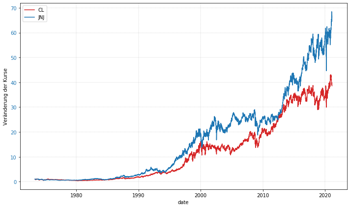
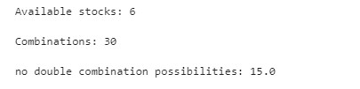
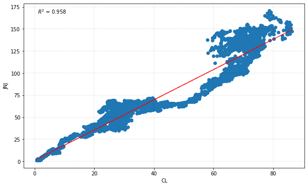
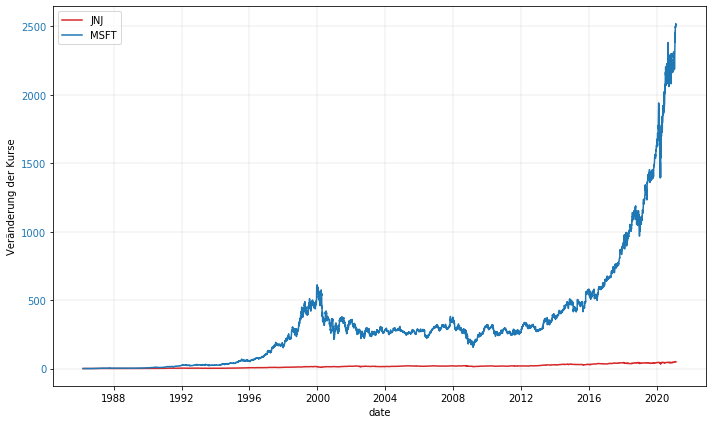
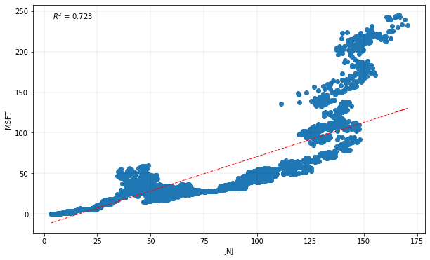

# Stock-comparisons-correlation-and-coefficients-of-determination
If possible, according to Ray Dalio, you should have a well-diversified portfolio. Stocks that correlate with each other should be avoided. Ideally, the risk/reward ratio is already reached with 8 positions, provided that the stocks do not correlate with each other.

In the following, a list of stocks is automatically downloaded and all stocks are compared with each other. Hereby the correlation and coefficients of determination




# Initialization
````python
from pandas_datareader import data as pdr
import yfinance as yf
import matplotlib.pyplot as plt
from datetime import date
from dateutil.relativedelta import relativedelta
import pandas as pd
import numpy as np
import os, sys
import time
import os
from os import makedirs
import shutil

import datetime # für die Datumsumrechnung
from email.mime.text import MIMEText
from email.mime.application import MIMEApplication
from email.mime.multipart import MIMEMultipart
from email.mime.base import MIMEBase
from email import encoders
from smtplib import SMTP
import smtplib
import sys

import matplotlib.pyplot as plt
import pandas as pd
import quandl as ql
from datetime import date
import time
import datetime
%matplotlib inline

UnixTime = int(time.time())
currentdate = datetime.datetime.fromtimestamp(UnixTime).strftime('%Y-%m-%d')


from datetime import datetime
now = datetime.now()
current_time = now.strftime("%H:%M:%S")
print("Current Time =", current_time)
````

# Preparation, download and data fitting 
```` python
Plot = 0
Info = 0
HardDateLimit = 0
path = 'C:/********/Kurs_Performance_Vergleich/'
date = time.strftime("%Y-%m-%d/")
new_path = path + date

Startdate = "2020-01-01"
Enddate = "2021-01-30"


data = {
    'Start': [],
    'End': [],
    'symbol1': [],
    'symbol2': [],
    'corr_Spearman': [],
    'R^2': []}
df = pd.DataFrame(data)
````

# Load list with stock symbols

Load the following list "21_02_16_StockSymbols.txt":


```` python
stockstxt = '21_02_16_StockSymbols.txt'
filename = path + stockstxt
with open(filename) as f:
    content = f.readlines()
Stocks = [x.strip() for x in content]
````

#  Download and save stock history data
```` python
os.makedirs(new_path, exist_ok=True) # Create new folder with the date as folder name

for i in Stocks:
    print(i)
    Download = yf.download(i)
    
    ### Wenn Leerzeile vorhanden, dann diese streichen
    Download.dropna(
        axis=0,
        how='any',
        thresh=None,
        subset=None,
        inplace=True
        )
    
    Download.to_csv (new_path + i + '.csv', index = True, header=True)
```` 

# Only load and compare data where sufficient data is available.
````python
mySize = '800000' # The min size of the file in Bytes --> must be larger than  800 KB
filesList= [] # All the file paths will be stored in this list
Stocks_new = []

for path, subdirs, files in os.walk(new_path):
    for name in files:
        filesList.append(os.path.join(path,name))

for i in filesList:
    fileSize = os.path.getsize(str(i)) # Getting the size in a variable
    if int(fileSize) >= int(mySize):
        #print(i.split("/")[-1][:-4])
        Stocks_new.append(i.split("/")[-1][:-4])

Stocks = Stocks_new
Stocks
````

# Combinatorics and no duplicate items
````python
Length = len(Stocks)
print('Available stocks: ' +str(Length))
print()
print('Combinations: ' + str((Length*Length)-Length))
print()
print('no double combination possibilities: ' + str(((Length*Length)-Length)/2))
print()

i = j = len(Stocks)
````



# Calculate and create plots
````python
Plot = 1
for ai in range (i):
    print(str(round((ai/len(Stocks))*100, 2)) + '%')
    for aj in range(j):
        if ai != aj: # without diagonal, so that no own values are taken twice
            if ai < aj: # lower triangular matrix only
                #print(Stocks[ai] + ' ' + Stocks[aj])
                Symbol1_name = Stocks[ai]
                Symbol2_name = Stocks[aj]
                
                Symbol1 = pd.read_csv(new_path + Stocks[ai] + '.csv', index_col=0)
                Symbol2 = pd.read_csv(new_path + Stocks[aj] + '.csv', index_col=0)
                
                Symbol1_range = Symbol1
                Symbol2_range = Symbol2
                
                
                if HardDateLimit == 1:
                    ## Period from to and only take over entries that exist from both entries
                    

                    Symbol1_range = (Symbol1.index > Startdate) & (Symbol1.index <= Enddate)
                    Symbol1_range = Symbol1.loc[Symbol1_range]
                    Symbol2_range = (Symbol2.index > Startdate) & (Symbol2.index <= Enddate)
                    Symbol2_range = Symbol2.loc[Symbol2_range]
                
                #index is perceived as object instead of datetime[ns] --> in plots it hangs up because every line is plotted
                Symbol1_range.index = Symbol1_range.index.astype('datetime64[ns]')
                Symbol2_range.index = Symbol2_range.index.astype('datetime64[ns]')
                
                
                if Info == 1:
                    print(Symbol1_name)
                    print('Shape Download')
                    print(Symbol1.shape)
                    print('')
                    print(Symbol2_name)
                    print('Shape Download')
                    print(Symbol2.shape)
                                    
                ######################### INTERSECTION ###########################
                # bring to the same length first
                A = Symbol1_range.index
                B = Symbol2_range.index
                C = A.intersection(B)
                # C = A[np.in1d(A, B)] #Alternative

                if Info == 1:
                    print('Remaining data with the same date')
                    print(C.shape)
                    print('')

                Symbol1_range = Symbol1_range.loc[C]
                Symbol2_range = Symbol2_range.loc[C]
                
                
                ######################### if no intersection is present JOIN A B no intersection then do not continue calculation ###########################

                if (len(Symbol1_range.Close) and len(Symbol2_range.Close)) > 100:
                    ########################## Determine correlation and R^2 #######################

                    x = Symbol1_range.Close
                    y = Symbol2_range.Close

                    import scipy.stats

                    Corr_Pearson = round(scipy.stats.pearsonr(x, y)[0], 3)
                    Corr_Spearman = round(scipy.stats.spearmanr(x, y)[0], 3)
                    Corr_Kendalltau = round(scipy.stats.kendalltau(x, y)[0], 3)

                    from sklearn.metrics import r2_score
                    z = np.polyfit(x, y, 1)
                    y_hat = np.poly1d(z)(x)
                    r2 = r2_score(y,y_hat).round(3)

                else:
                    Corr_Pearson = 0
                    Corr_Spearman = 0
                    Corr_Kendalltau = 0
                    r2 = 0

                if Info == 1:
                    print(Corr_Pearson)
                    print(Corr_Spearman)
                    print(Corr_Kendalltau)
                    print(r2)
                
                data = {
                    'Start': [Symbol1_range.index[0]][0],
                    'End': [Symbol1_range.index[-1]][0],
                    'symbol1': [Stocks[ai]][0],
                    'symbol2': [Stocks[aj]][0],
                    'corr_Spearman': [Corr_Spearman][0],
                    'R^2': [r2][0]}
                df = df.append(data, ignore_index=True)
                
                
                if Plot == 1:
                    # Time series plot with absolute values
                    fig, ax1 = plt.subplots(figsize=(10,6))
                    ax1.grid(color='black', linestyle='--', linewidth=0.1)
                    color1 = 'tab:red'
                    ax1.set_xlabel('date')
                    ax1.set_ylabel('Kurs 1 in USD', color=color1)
                    ax1.plot(Symbol1_range.index, Symbol1_range.Close, label=Symbol1_name, color=color1)
                    ax1.tick_params(axis='y', labelcolor=color1)
                    ax1.legend()
                    ax2 = ax1.twinx()  # instantiate a second axes that shares the same x-axis
                    color2 = 'tab:blue'
                    ax2.set_ylabel('Kurs 2 in USD', color=color2)  # we already handled the x-label with ax1
                    ax2.plot(Symbol2_range.index, Symbol2_range.Close, label=Symbol2_name, color=color2)
                    ax2.tick_params(axis='y', labelcolor=color2)
                    ax2.legend()
                    fig.tight_layout()  # otherwise the right y-label is slightly clipped

                    # Time series diagram with percentage change
                    Symbol1_range_p = Symbol1_range.Close / Symbol1_range.Close[0]
                    Symbol2_range_p = Symbol2_range.Close / Symbol2_range.Close[0]
                    fig, ax1 = plt.subplots(figsize=(10,6))
                    ax1.grid(color='black', linestyle='--', linewidth=0.1)
                    color1 = 'tab:red'
                    ax1.set_xlabel('date')
                    ax1.plot(Symbol1_range.index, Symbol1_range_p, label=Symbol1_name, color=color1)
                    ax1.tick_params(axis='y', labelcolor=color1)
                    #ax2 = ax1.twinx()  # instantiate a second axes that shares the same x-axis
                    color2 = 'tab:blue'
                    ax1.set_ylabel('Veränderung der Kurse')  # we already handled the x-label with ax1
                    ax1.plot(Symbol2_range.index, Symbol2_range_p, label=Symbol2_name, color=color2)
                    ax1.tick_params(axis='y', labelcolor=color2)
                    ax1.legend()
                    fig.tight_layout()  # otherwise the right y-label is slightly clipped

                    # Scatter
                    x = Symbol1_range.Close
                    y = Symbol2_range.Close
                    fig, ax1 = plt.subplots(figsize=(10,6))
                    ax1.grid(color='black', linestyle='--', linewidth=0.1)
                    plt.scatter(x,y)
                    plt.xlabel(Symbol1_name)
                    plt.ylabel(Symbol2_name)


                    from sklearn.metrics import r2_score
                    z = np.polyfit(x, y, 1)
                    y_hat = np.poly1d(z)(x)
                    plt.plot(x, y_hat, "r--", lw=1)

                    text = f"$y={z[0]:0.3f}\;x{z[1]:+0.3f}$\n$R^2 = {r2_score(y,y_hat):0.3f}$"
                    text = "${R^2}$ = " + str(r2_score(y,y_hat).round(3))
                    plt.gca().text(0.05, 0.95, text,transform=plt.gca().transAxes,
                         fontsize=10, verticalalignment='center')


from datetime import date
from datetime import datetime
currentdate = datetime.today().strftime('%Y-%m-%d')
# save pandas as CSV
FileName = currentdate + "_Correlationen.csv"
df.to_csv (os.path.join(path, FileName), index = True, header=True)
````


# Results

As a result we get a CSV list with the following entries


| Index | Start | End | symbol1 | symbol2 | corr_Spearman | R^2 |
|     :---:      | :---:      | :---:      | :---:      | :---:      | :---:      |   :---:      | 
| 0 | 1986-08-13 | 2021-02-16 | ADBE | AMD | 0.203 | 0.518 | 
| 1 | 1986-08-13 | 2021-02-16 | ADBE | CL | 0.959 | 0.526 | 
| 2 | 1986-08-13 | 2021-02-16 | ADBE | JNJ | 0.971 | 0.655 | 
| 3 | 1986-08-13 | 2021-02-16 | ADBE | MSFT | 0.905 | 0.947 | 
| 4 | 1986-08-13 | 2021-02-16 | ADBE | TXN | 0.926 | 0.851 | 
| 5 | 1980-03-17 | 2021-02-16 | AMD | CL | 0.106 | 0.088 | 
| 6 | 1980-03-17 | 2021-02-16 | AMD | JNJ | 0.14 | 0.159 | 
| 7 | 1986-03-13 | 2021-02-16 | AMD | MSFT | 0.257 | 0.536 | 
| 8 | 1980-03-17 | 2021-02-16 | AMD | TXN | 0.311 | 0.396 | 
| 9 | 1973-05-02 | 2021-02-16 | CL | JNJ | 0.974 | 0.958 | 
| 10 | 1986-03-13 | 2021-02-16 | CL | MSFT | 0.904 | 0.596 | 
| 11 | 1973-05-02 | 2021-02-16 | CL | TXN | 0.924 | 0.763 | 
| 12 | 1986-03-13 | 2021-02-16 | JNJ | MSFT | 0.898 | 0.723 | 
| 13 | 1972-06-01 | 2021-02-16 | JNJ | TXN | 0.925 | 0.841 | 
| 14 | 1986-03-13 | 2021-02-16 | MSFT | TXN | 0.947 | 0.903 |


and the following plots





